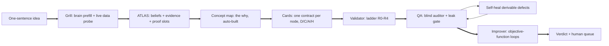

# AAC Factory

**Vague agent idea in → certified, self-healing agent blueprint out. Human over the loop, never in it.**

The factory interviews you, maps what it learns, writes a measurable contract for every moving
part, inspects its own work like a blind auditor, fixes the boring defects itself, optimizes each
node against its objective function, and hands you back a verdict plus a short async queue of the
only decisions that are genuinely human.

Loop architecture is canonical here: a loop is the bounded improvement system, a gate/router chooses
repeat/repair/escalate/exit/promote, and AAC Factory is one intervention-builder inside larger
business/life loops. See [`docs/LOOP-ARCHITECTURE.md`](docs/LOOP-ARCHITECTURE.md).



## Quickstart

```bash
python3 scripts/new_agent_package.py "My Agent Idea"
```

Fill `concepts/<slug>/atlas/atlas.json` from the interview (spine, clusters, beliefs with
confidence / provenance / proof slots), drop the interview packet at
`process/source_packet.aac.json` if you have one, then:

```bash
python3 scripts/run_pipeline.py concepts/<slug> --improve
```

One command runs: concept-map synthesis → AAC cards → validation ladder → dark-factory QA →
self-heal loop → improvement loops → combined export → **your human queue**. Exit 0 on
allow/revise, 1 on block. (A worked example package is coming; until then, the regression tests
in `tests/` build a complete synthetic package end to end — read them as executable examples.)

## Your preferences (models, harness, local models)

Edit `factory.config.json` at the repo root: pick the judgment harness (`anthropic-api`,
`claude-code-headless` for OAuth-CLI with no API key, `hermes-skill`, or `local-model`), the auth
mode, your model ladder, an optional default judgment model, and the deploy `runtime_target`.
**No preferences yet? Run `python3 scripts/scan_models.py --write-config`** — it detects which
providers you actually have (Anthropic, OpenAI, Gemini, Mistral, DeepSeek via API keys; Anthropic
via the `claude` CLI with no key; Ollama local models via a 2s ping) and builds your ladder from
the multi-provider catalog (`scripts/model_catalog.json`, landscape snapshot 2026-06). Installed
Ollama models join as cost-rank-0 (free) challengers. Per-node card values always override preferences, and editing the config
never silently mutates existing cards. Models stay testable and swappable per node forever:
`improve_node.py` trials the ladder and adopts only on better-or-equal-and-cheaper with a sealed
holdout pass.

## Sharing this repo / getting started cold

Clone it, open it in Claude Code (reads `CLAUDE.md`) or any agent CLI (reads `AGENTS.md`), and say
"grill this idea: <one sentence>". The agent scaffolds the package, interviews you in plain
language, and runs the pipeline. Your packages under `concepts/` are **gitignored by default** —
the factory is public, your workflows are private. Manual path: set `factory.config.json`, then
run this from the repo root:

`python3 scripts/new_agent_package.py "My Idea" && python3 scripts/run_pipeline.py concepts/my-idea --improve`

Verify the toolchain anytime: `cd tests && python3 test_agent_pipeline.py && python3 test_improvement_loop.py && python3 test_preferences.py`

## What is automated vs what stays human

| Automated (the loop) | Human (over the loop, async) |
|---|---|
| Map synthesis, card generation, lint | Golden grading (grade real records, never author) |
| Validation ladder R0/R1, R2 on graded goldens | Residue statement signing |
| Blind QA, leak gate, verdicts | Lane promotion to R3/R4 |
| Self-healing of derivable defects | Anything irreversible or external (send/write/pay/delete) |
| Cheaper-model trials + adoption via holdout gate | Justifying any inline human gate |

Every C/A node card carries `supervision` (review queue, sampling, escalation triggers,
`inline_approval: false`) and a measurable `objective` (golden accuracy target, guardrails,
cost-minimize, improvement policy). Every workflow card carries the `automation_policy`.

## The improvement loop (Karpathy-style)

Each judgment node is an optimizable unit with an objective function. `improve_node.py`
evaluates the champion config, trials cheaper challengers from your ladder (factory.config.json, the machine scan, or built-ins), calibrates
confidence floors from live run cards when they exist, and adopts a challenger only when it is
better, or equal and cheaper, AND passes the sealed holdout split. Adoption updates the card,
writes `exports/improvement_ledger.jsonl`, and re-enters QA like any human change. The improver
develops on the open split only; selection code cannot read the holdout.

"Fine-tune" today means prompt/threshold/model optimization. Weight-level fine-tuning plugs in
when a provider path exists. Until the S6 compiler ships live executors, evals run on stub
(replay) executors: the loop mechanics are test-proven; live model quality measurement arrives
with the compiler.

This is the node-level version of the broader loop architecture in
[`docs/LOOP-ARCHITECTURE.md`](docs/LOOP-ARCHITECTURE.md): evidence enters, a gate routes repeat /
repair / escalate / exit / promote, and every adopted change re-enters QA and the readiness ladder.

## QA: dark-factory holdout

The deterministic auditor re-derives every expectation from the sources (atlas + schemas), re-runs
lint itself, and never trusts builder claims. Weighted scoring (critical 3 / major 2 / minor 1,
threshold 0.75), verdicts allow / revise / block. Criteria live in gitignored `.holdout/`; the
builder reads `exports/qa_findings.md` only. The leak gate (emails, phones, SSN, API keys) is a
blocking critical. Judgment criteria are graded by a blind LLM pass (dark-factory-qa pattern).

## Self-healing

QA feedback drives a heal → validate → QA loop (max 3 passes). AUTO fixes only what is derivable
by convention (stale exports, missing stubs, telemetry/supervision/objective/policy blocks).
Meaning changes, runtime assignment, golden grades, and leak findings always queue for the human
in `exports/repair_proposals.json`.

## Telemetry is a contract

Every node card requires run-card telemetry (QA blocks otherwise). Executing agents emit per-run
cards via `scripts/runcard.py`: gate outcomes, confidence, model + prompt versions, cost,
refusals with reasons, `external_actions_taken`, escalations auto-queued to
`process/run-cards/_review_queue/`. Run cards are the promotion evidence and the improver's food.

## Versioning

**aac-factory v0.2.0** implements the AAC 2.5 pipeline proposal
([agent-automation-creator](https://github.com/AnkitClassicVision/agent-automation-creator),
branch `feat/aac-2.5-proposal`). The factory is fast-moving code with its own semver; the AAC
framework versions slowly, on evidence. **AAC 3.0 is reserved** until this factory has shipped
2-3 real agents end to end (golden sets graded, blind QA cadence running, S6 compiler live).

## Layout

```
scripts/            the 11-stage toolchain + models.json ladder
concepts/_template_agent_package/   three-layer package template
concepts/_template_concept_map/     river-map template (SQLite + lint + exports)
concepts/triage-example/            working example built by this pipeline
tests/              regression suite (pipeline, suggester, run cards, improvement loop)
docs/               pipeline spec + autonomy/QA/self-heal spec
```

## Compile and run (S6)

`python3 scripts/compile_agent.py concepts/<slug>` turns certified cards into a runnable agent
under `concepts/<slug>/build/`: an orchestrator that walks the graph enforcing confidence floors,
hard-refuse + leak scans, and bounded routing; per-node LLM adapters (Anthropic API, `claude -p`
OAuth, OpenAI-compatible for OpenAI/DeepSeek/Mistral/Gemini, local Ollama); D-node handler stubs
(yours to implement, never overwritten); a run card per node execution; an async human review
queue; and deploy snippets (cron / systemd timer) per your `runtime_target`.

Honesty is compiled in: packages with TODO fields or ungraded goldens build in **shadow lane**
(internal artifacts only) no matter what the card requests, and the emitted runtime contains
**zero external effectors by construction** — send/write code is absent, not disabled. Smoke any
build offline: `FACTORY_FAKE_LLM=1 python3 build/agent/main.py '{}'`. Kill switch: `touch build/KILL`.

## Roadmap

1. Blind LLM QA pass on cadence (weekly cron per package)
2. Improver on live run-card streams (drift-triggered, not just scheduled)
3. Compiled-executor evals (evaluate_node runs the real build instead of replay stubs)
